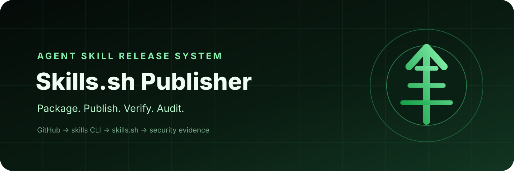
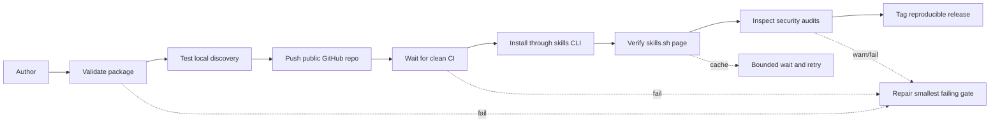

<div align="center">
  
  <h3>The release system for Agent Skills</h3>
  <p>Turn a local <code>SKILL.md</code> into an installable GitHub package, a verified skills.sh listing, and an auditable release.</p>
  <p>
    <a href="https://skills.sh/clownnvd/skills-sh-publisher/skills-sh-publisher"></a>
    <a href="https://github.com/Clownnvd/skills-sh-publisher/actions/workflows/ci.yml"></a>
    <a href="LICENSE"></a>
    
    
  </p>
</div>

---

## The gap this skill closes

Writing `SKILL.md` is only the first state in a release. A skill can be valid locally but absent from Git, installable from GitHub but missing from skills.sh, listed but stale, or public without completed security audits.

**Skills.sh Publisher treats every state as a separate gate with separate evidence.**



## Install

```bash
npx skills add Clownnvd/skills-sh-publisher --skill skills-sh-publisher
```

```text
$skills-sh-publisher Package this local Agent Skill, publish it as a public GitHub repository, and verify its skills.sh listing and audits.
```

## What it verifies

| Gate | Evidence |
|---|---|
| Package validity | Frontmatter, naming, links, file limits, secret patterns |
| Release hygiene | README, license, security policy, contribution guide, CI |
| CLI discovery | Local and public `npx skills add ... --list` |
| GitHub publication | Public repository, default-branch commit, passing CI |
| Catalog discovery | Canonical skills.sh page after tracked installation |
| Trust status | Independent provider audit verdicts |
| Release identity | Optional semantic tag and GitHub release |

## Deterministic tools

Validate a release package:

```bash
python scripts/validate_skill_release.py /path/to/skill --strict
```

Verify its public state:

```bash
python scripts/verify_publication.py Clownnvd/skills-sh-publisher skills-sh-publisher --require-audits
```

Both tools emit structured JSON and meaningful exit codes. Authentication errors, cache delays, missing audits, warnings, and failures remain visible instead of becoming false success.

## Field-tested insight

There is no manual leaderboard submission button. A public GitHub repository makes a skill installable; an authorized `npx skills add owner/repository` run with anonymous telemetry enabled makes the catalog aware of it. Indexing and audits happen afterward and need separate verification.

This workflow came from shipping [Task Mitosis](https://github.com/Clownnvd/task-mitosis), including the canonical badge repair and the distinction between GitHub release, catalog indexing, and provider audits.

## Repository map

```text
skills-sh-publisher/
|-- SKILL.md
|-- agents/openai.yaml
|-- references/
|-- scripts/
|-- tests/
|-- assets/
`-- .github/workflows/ci.yml
```

## Safety model

Local packaging permission is separate from public mutation permission. The skill never stores credentials and does not create repositories, push commits, create releases, or emit install telemetry unless the current request authorizes those actions.

## License

[MIT](LICENSE) © 2026 Nguyễn Văn Duy
